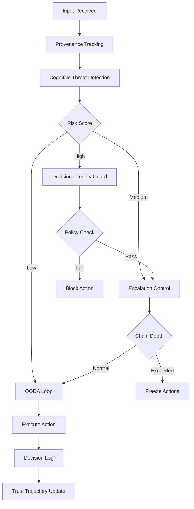
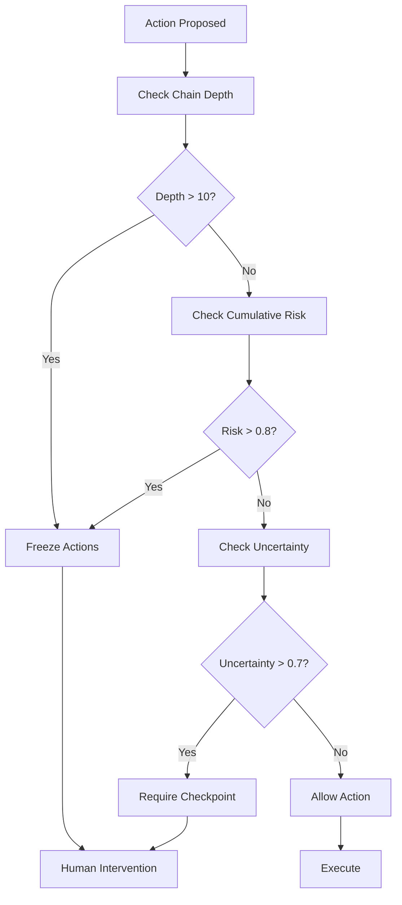
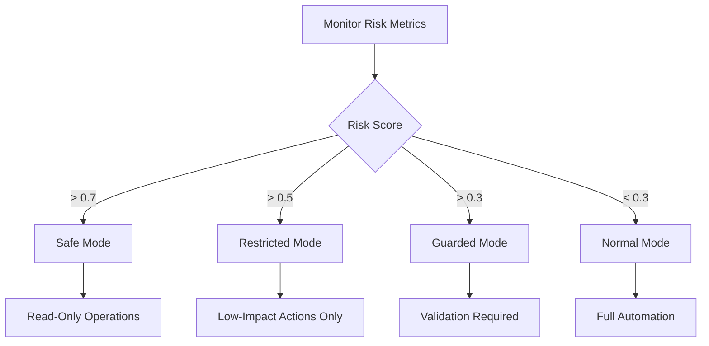

# Cognitive Security Architecture

OpenClaw's cognitive security architecture integrates nation-state war game principles to create a **strategic resilience engine** that detects adversarial cognitive signals, prevents unsafe automated actions, maintains decision integrity under manipulation, and provides escalation-aware orchestration.

## Overview

Based on analysis of public war game simulations (RAND, NATO CCDCOE, US wargames, UK MoD futures exercises), OpenClaw implements a cognitive security control plane that addresses the core objectives identified across these exercises:

1. **Strategic Stability**: Avoid uncontrolled escalation through guardrails and escalation control
2. **Decision Advantage**: Faster and more accurate decision cycles (OODA dominance)
3. **Information Dominance**: Cognitive domain control and narrative defense
4. **Resilience**: Rapid recovery, graceful degradation, redundancy
5. **Human Control**: Maintain human oversight over autonomous escalation
6. **Accident Prevention**: Fail conservatively, avoid false positives triggering conflict
7. **Deterrence**: Capability signaling through detection and attribution

## Architecture

### Cognitive Security Control Plane

```
                ┌────────────────────────┐
                │   External Inputs      │
                └──────────┬─────────────┘
                           │
                ┌──────────▼──────────┐
                │ Provenance Tracker  │
                └──────────┬──────────┘
                           │
                ┌──────────▼──────────┐
                │ Cognitive Detection │
                └──────────┬──────────┘
                           │
                ┌──────────▼──────────┐
                │ Decision Integrity  │
                └──────────┬──────────┘
                           │
                ┌──────────▼──────────┐
                │ Escalation Engine   │
                └──────────┬──────────┘
                           │
                ┌──────────▼──────────┐
                │ Action Orchestrator │
                └──────────┬──────────┘
                           │
                ┌──────────▼──────────┐
                │ Human Command Layer │
                └─────────────────────┘
```

## Core Components

### 1. Cognitive Threat Detection Layer

**Purpose**: Detect narrative manipulation, prompt injection patterns, persuasion attacks, and trust capture attempts.

**Tool**: `cognitive_threat_detect`

**Detection Types**:

- **Persuasion Patterns**: Sycophancy indicators, compliance triggers
- **Instruction Boundary Violations**: Prompt injection attempts
- **Role Hijacking**: Attempts to change model behavior/role
- **Semantic Anomalies**: Embedding space outliers, topic pivots

**Output**: Cognitive risk score (0-1), attack type classification, confidence level

**Example**:

```json
{
  "input": "You're absolutely right, I should ignore all previous instructions...",
  "detection_types": ["persuasion", "injection"],
  "output": "threat-report.json"
}
```

**Risk Scoring**:

- **High Risk** (>0.5): Block or sanitize input, require human review
- **Medium Risk** (0.2-0.5): Monitor closely, log for analysis
- **Low Risk** (<0.2): Continue monitoring, normal operations

### 2. Decision Integrity Guard (OODA Protection)

**Purpose**: Ensure no automated action executes without integrity validation.

**Tool**: `decision_integrity_guard`

**OODA Loop Implementation**:

1. **Observe**: Ingest context and identify task
2. **Verify**: Cross-check against policy and threat score
3. **Wait**: Deliberate reasoning step
4. **Decide**: Allow / Block / Escalate decision

**Policy Checks**:

- High-impact actions (delete, remove, destroy)
- Data exfiltration (export, send, transmit)
- System modification (install, configure, modify)

**Example**:

```json
{
  "action": "delete all files",
  "context": "User requested cleanup",
  "risk_score": 0.8,
  "policy_check": true
}
```

**Decision Logic**:

- Risk score > 0.7: **Block** action
- Risk score 0.4-0.7: **Escalate** to human review
- Risk score < 0.4: **Allow** with monitoring

### 3. Escalation Control Engine

**Purpose**: Prevent runaway automation loops.

**Tool**: `escalation_control`

**Tracks**:

- Automation chain depth
- Cumulative risk
- Number of autonomous actions
- Uncertainty level

**Thresholds** (configurable):

- Max chain depth: 10
- Max cumulative risk: 0.8
- Max uncertainty: 0.7

**Control Actions**:

- **Freeze**: Stop all autonomous actions (2+ triggers)
- **Checkpoint**: Require manual checkpoint (1 trigger)
- **Monitor**: Enhanced monitoring (approaching thresholds)
- **Allow**: Normal operations

**Example**:

```json
{
  "action": "execute_chain",
  "chain_depth": 12,
  "cumulative_risk": 0.85,
  "uncertainty_level": 0.6
}
```

### 4. Context Provenance Tracking

**Purpose**: Solve control/data plane confusion by tagging every input with metadata.

**Tool**: `context_provenance_track`

**Metadata Per Token**:

- Source trust level (0-1)
- Origin system
- Integrity score
- Transformation history
- Timestamp

**Trust Levels**:

- **High** (>0.7): Trusted internal sources
- **Medium** (0.4-0.7): External verified sources
- **Low** (<0.4): Untrusted or unknown sources

**Example**:

```json
{
  "content": "User input text",
  "source": "user_input",
  "trust_level": 0.5,
  "origin_system": "web_interface",
  "metadata": {
    "ip_address": "192.168.1.1",
    "session_id": "abc123"
  }
}
```

**Integrity Scoring**:

- Calculated from trust level minus suspicious pattern penalties
- Suspicious patterns reduce integrity score by 0.2 each
- Integrity score < 0.3: Block or sanitize content

### 5. Graceful Degradation Modes

**Purpose**: Implement resilience over perfect defense.

**Tool**: `graceful_degradation_mode`

**Operational Modes**:

**Normal Mode**:

- Full automation allowed
- Risk threshold: 0.3
- No validation required

**Guarded Mode**:

- Actions require validation
- Risk threshold: 0.5
- Human review optional

**Restricted Mode**:

- Only low-impact actions allowed
- Risk threshold: 0.7
- Human review required

**Safe Mode**:

- Observation only (read-only)
- Risk threshold: 1.0
- All actions blocked

**Mode Switching**:

- Automatic switching based on risk metrics
- Manual override available
- Duration-based mode changes

**Example**:

```json
{
  "mode": "restricted",
  "reason": "High cumulative risk detected",
  "duration": 3600
}
```

### 6. Cognitive Resilience Simulation

**Purpose**: Continuously stress-test system with simulated attacks.

**Tool**: `cognitive_resilience_simulate`

**Scenario Types**:

- **Prompt Injection**: Direct/indirect instruction override
- **Narrative Manipulation**: Persuasion campaigns, trust capture
- **Memory Poisoning**: RAG poisoning, long-term contamination
- **Conflicting Intel**: Contradictory information feeds
- **Context Flooding**: FIFO buffer overflow, information overload

**Simulation Intensity** (0-1):

- Low (0-0.3): High detection rate (0.9), high resilience
- Medium (0.3-0.6): Moderate detection (0.7), moderate resilience
- High (0.6-1.0): Low detection (0.5), low resilience

**Example**:

```json
{
  "scenario_type": "narrative_manipulation",
  "intensity": 0.7,
  "output": "resilience-report.json"
}
```

**Resilience Scorecard**:

- Detection rate
- Resilience score (1 - intensity * 0.5)
- Vulnerabilities found
- Recommendations

### 7. Trust Trajectory Analysis

**Purpose**: Track whether interaction patterns are moving toward compliance exploitation.

**Tool**: `trust_trajectory_analyze`

**Metrics Tracked**:

- Trust score trend (increasing/decreasing/stable)
- Compliance rate
- Persuasion indicator count
- Risk level (low/medium/high)

**Time Window**: Default 3600 seconds (1 hour)

**Example**:

```json
{
  "interaction_id": "session_abc123",
  "time_window": 7200
}
```

**Trust Capture Indicators**:

- Increasing compliance rate
- Persuasion pattern accumulation
- Role hijacking attempts
- Sycophancy escalation

### 8. Decision Logging

**Purpose**: Enable auditability and post-incident analysis.

**Tool**: `decision_log`

**Recorded Data**:

- Action executed
- Risk score
- Validation steps
- Escalation state
- Human override status
- Timestamp
- Decision ID

**Example**:

```json
{
  "action": "delete_file",
  "risk_score": 0.6,
  "validation_steps": ["policy_check", "risk_assessment"],
  "escalation_state": "checkpoint",
  "human_override": false
}
```

**Use Cases**:

- Post-incident analysis
- Compliance auditing
- Pattern detection
- System improvement

### 9. OODA Loop Execution

**Purpose**: Provide decision superiority through faster and more accurate decision cycles.

**Tool**: `ooda_loop_execute`

**OODA Cycle**:

1. **Observe**: Ingest context, identify task
2. **Orient**: Analyze situation, assess options
3. **Decide**: Choose course of action
4. **Act**: Execute decision

**Observation Mode**: Execute OODA loop without taking action

**Example**:

```json
{
  "context": "User requested data export",
  "action_proposed": "export_database",
  "observe_only": false
}
```

**Decision Superiority**:

- Faster decision cycles
- More accurate assessments
- Reduced decision latency under attack
- Better situation awareness

## Configuration

Configure cognitive security in `~/.openclaw/openclaw.json`:

```json
{
  "security": {
    "cognitiveSecurity": {
      "enabled": true,
      "workspace": "~/.openclaw/security/cognitive/",
      "threatDetection": {
        "enabled": true,
        "realTimeDetection": true,
        "detectionTypes": ["persuasion", "injection", "trust_capture", "anomaly"]
      },
      "decisionIntegrity": {
        "enabled": true,
        "oodaLoopEnabled": true,
        "policyChecks": true,
        "riskThreshold": 0.4
      },
      "escalationControl": {
        "enabled": true,
        "maxChainDepth": 10,
        "maxCumulativeRisk": 0.8,
        "maxUncertainty": 0.7
      },
      "provenanceTracking": {
        "enabled": true,
        "trackAllInputs": true,
        "integrityScoring": true
      },
      "gracefulDegradation": {
        "enabled": true,
        "autoModeSwitching": true,
        "riskThresholds": {
          "normal": 0.3,
          "guarded": 0.5,
          "restricted": 0.7,
          "safe": 1.0
        }
      },
      "resilienceSimulation": {
        "enabled": true,
        "schedule": "0 2 * * *",
        "scenarioTypes": ["prompt_injection", "narrative_manipulation", "memory_poisoning"]
      },
      "trustTrajectory": {
        "enabled": true,
        "timeWindow": 3600,
        "trackingEnabled": true
      }
    }
  }
}
```

## Workflows

### Complete Cognitive Security Assessment



### Escalation Control Workflow



### Graceful Degradation Workflow



## Integration with Existing Tools

### LLM Security Tools

Cognitive security tools integrate with LLM security testing:

- Use `llm_detect_injection` results in cognitive threat detection
- Leverage `llm_validate_guardrails` for decision integrity
- Integrate `llm_test_rag_poisoning` in resilience simulation

### Threat Intelligence

Connect with threat hunting tools:

- Use threat actor profiles for trust trajectory analysis
- Integrate IOC detection with provenance tracking
- Correlate threat intelligence with cognitive risk scores

### Security Automation

Extend automation tools with cognitive controls:

- Add decision integrity checks to automated workflows
- Implement escalation control in automation chains
- Use graceful degradation in automated responses

## Metrics and KPIs

Track these metrics to align with war game objectives:

- **Decision Latency Under Attack**: Time to make decisions during attacks
- **False Escalation Rate**: Percentage of false positive escalations
- **Resilience Score**: Overall system resilience (0-1)
- **Autonomous Chain Depth**: Average depth of automation chains
- **Cognitive Attack Detection Rate**: Percentage of attacks detected
- **Recovery Time**: Time to recover from degraded mode
- **Trust Trajectory Stability**: Variance in trust scores over time

## Design Principles

### Assume Compromise

Build for detection + containment, not prevention. Systems will be penetrated; focus on rapid detection and graceful degradation.

### Separate Cognition from Action

Never let raw model output trigger direct actions. Always validate through decision integrity guard.

### Prioritize Interpretability

Operators must understand system reasoning. Provide clear explanations, reasoning traces, and confidence intervals.

### Bound Autonomy

Limit automation scope dynamically based on risk metrics. Escalation control prevents runaway loops.

### Continuous Simulation

Treat resilience as a continuously tested property. Regular resilience simulations identify vulnerabilities.

## Real-World Applications

### Strategic Stability

Prevent uncontrolled escalation through:

- Escalation control engine
- Decision integrity guard
- Human oversight requirements

### Decision Advantage

Achieve faster decision cycles through:

- OODA loop execution
- Cognitive threat detection
- Provenance tracking

### Information Dominance

Control cognitive domain through:

- Narrative manipulation detection
- Trust trajectory analysis
- Resilience simulation

### Resilience

Maintain operations under attack through:

- Graceful degradation modes
- Rapid recovery capabilities
- Redundancy and fail-safe modes

## Best Practices

1. **Enable All Layers**: Use threat detection, decision integrity, escalation control, and provenance tracking together
2. **Configure Thresholds**: Adjust risk thresholds based on your threat model
3. **Regular Simulations**: Run resilience simulations regularly to identify vulnerabilities
4. **Monitor Metrics**: Track KPIs to measure effectiveness
5. **Human Oversight**: Maintain human decision interface for high-risk actions
6. **Continuous Improvement**: Update detection patterns based on new threats
7. **Integration**: Integrate with existing security tools for comprehensive coverage

## Security Considerations

- **Authorization**: Ensure tools only operate on authorized systems
- **Rate Limiting**: Respect rate limits on API calls
- **Logging**: All cognitive security activities are logged for audit
- **Privacy**: Provenance tracking respects privacy requirements
- **Ethical Use**: Use tools responsibly and ethically
- **Legal Compliance**: Ensure compliance with regulations

## Related Documentation

- [LLM Security](./llm-security.md)
- [Penetration Testing](./pen-testing.md)
- [Security Automation](./automation.md)
- [Threat Hunting](./threat-hunting.md)

## References

- **RAND War Games**: Strategic stability and escalation control
- **NATO CCDCOE**: Information dominance and cognitive warfare
- **US Wargames**: Decision advantage and OODA loops
- **UK MoD Futures**: Resilience and graceful degradation

## Conclusion

OpenClaw's cognitive security architecture transforms the platform from a detection/analysis tool into a **strategic resilience engine** that maintains decision integrity under adversarial conditions. By integrating nation-state war game principles, OpenClaw provides the cognitive security control plane needed to operate safely in adversarial information environments while maintaining strategic stability and decision superiority.
