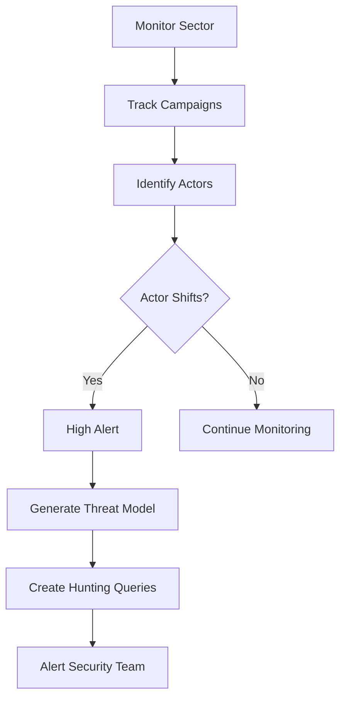
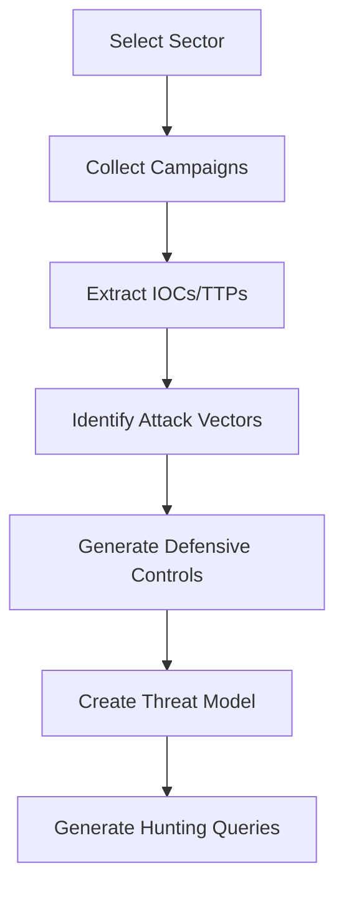

# Sector Intelligence: Tracking Sector-Specific Threats

Threat actors often target specific sectors and shift between them over time. Sector intelligence enables early warning when actors shift to your sector and helps build sector-specific threat models.

## Overview

Sector intelligence provides:

- **Sector Attack Pattern Tracking**: Monitor which sectors are being targeted
- **Actor Sector Shift Detection**: Alert when threat actors shift to new sectors
- **Sector-Specific Threat Models**: Generate threat models tailored to specific sectors
- **Early Warning Systems**: Get alerts before actors fully shift to your sector

## Sector Attack Patterns

### Example: Scattered Spider

Scattered Spider has demonstrated clear sector targeting patterns:

- **UK Retail** (April)
- **US Retail** (May)
- **Insurance** (June) - Three insurance companies hit in five days
- **Aviation** (recently)

This pattern shows the importance of sector intelligence - when actors shift sectors, organizations in the new sector should be on high alert.

### Using `sector_intelligence_track`

The `sector_intelligence_track` tool tracks sector-specific attack patterns:

```typescript
// Track retail sector threats
{
  "sector": "retail",
  "actor_id": "scattered-spider",
  "time_range": "last_90_days",
  "alert_on_shift": true,
  "generate_threat_model": true,
  "generate_hunting_queries": true
}
```

**Key Features:**

- **Campaign Tracking**: Monitor active campaigns targeting specific sectors
- **Actor Identification**: Identify which actors are targeting each sector
- **Sector Shift Detection**: Alert when actors shift to new sectors
- **Threat Model Generation**: Generate sector-specific threat models
- **Hunting Query Generation**: Create sector-specific hunting queries

## Supported Sectors

### Retail

**Attack Vectors:**

- Point-of-sale (POS) system compromise
- Payment card data theft
- E-commerce platform attacks
- Supply chain attacks
- Social engineering (call center)

**Defensive Controls:**

- PCI DSS compliance
- Secure POS systems
- Monitor payment card data access
- Train call center staff on social engineering
- Network segmentation

### Insurance

**Attack Vectors:**

- Policy and claims system access
- Customer data theft
- Social engineering (call center)
- Credential theft
- Ransomware attacks

**Defensive Controls:**

- Secure policy and claims systems
- MFA for all accounts
- Monitor customer data access
- Train call center staff
- Data loss prevention

### Aviation

**Attack Vectors:**

- Flight operations system compromise
- Critical infrastructure access
- Pre-positioning for kinetic operations
- OT/ICS system attacks
- Supply chain attacks

**Defensive Controls:**

- Secure flight operations systems
- OT/ICS security controls
- Monitor for pre-positioning activity
- Network segmentation
- Resilience and recovery plans

### Healthcare

**Attack Vectors:**

- Patient data theft
- Medical device compromise
- Ransomware attacks
- HIPAA violations
- Hospital operations disruption

**Defensive Controls:**

- Secure patient data systems
- HIPAA compliance
- Secure medical devices
- Monitor for ransomware
- Backup and recovery

### Financial

**Attack Vectors:**

- Banking system compromise
- Payment processing attacks
- Cryptocurrency theft
- SWIFT network attacks
- ATM attacks

**Defensive Controls:**

- Banking security controls
- Secure payment processing
- Monitor SWIFT network
- Fraud detection
- Secure cryptocurrency wallets

## Sector Shift Detection

### Early Warning System

When threat actors shift sectors, organizations in the new sector should be on high alert. Sector intelligence provides early warning:

```typescript
// Detect sector shift
{
  "sector": "aviation",
  "actor_id": "scattered-spider",
  "alert_on_shift": true
}
```

**Detection Logic:**

1. **Track Actor Campaigns**: Monitor all campaigns by the actor
2. **Identify Sectors**: Extract sectors from campaign data
3. **Detect Shifts**: Compare current sector to historical sectors
4. **Generate Alert**: Alert when shift detected

**Example Output:**

```json
{
  "sector_shift_detected": true,
  "previous_sectors": ["retail", "insurance"],
  "shift_pattern": "scattered-spider: retail, insurance → aviation",
  "alert_level": "high",
  "message": "Sector shift detected: scattered-spider has targeted retail, insurance and may be shifting to aviation. High alert recommended."
}
```

## Sector-Specific Threat Models

### Threat Model Generation

Sector intelligence automatically generates sector-specific threat models:

```typescript
{
  "sector": "retail",
  "generate_threat_model": true
}
```

**Threat Model Includes:**

- **Threat Actors**: Actors targeting the sector
- **Active Campaigns**: Current campaigns in the sector
- **Attack Vectors**: Sector-specific attack vectors
- **Defensive Controls**: Sector-specific defensive controls
- **IOCs**: Indicators of compromise from sector campaigns
- **TTPs**: MITRE ATT&CK techniques used in sector attacks

## Sector Intelligence Workflows

### Workflow 1: Sector Monitoring



### Workflow 2: Sector Threat Model



## Configuration

Configure sector intelligence in your `openclaw.config.json`:

```json
{
  "security": {
    "threatHunting": {
      "sectorTracking": {
        "enabled": true,
        "sectors": ["retail", "insurance", "aviation", "healthcare"]
      }
    }
  }
}
```

## Best Practices

1. **Monitor Your Sector**: Continuously monitor your sector for threats
2. **Track Actor Shifts**: Pay attention when actors shift sectors
3. **Early Warning**: Use sector shifts as early warning indicators
4. **Sector-Specific Controls**: Implement sector-specific defensive controls
5. **Threat Model Updates**: Regularly update sector threat models
6. **Cross-Sector Learning**: Learn from attacks in other sectors

## Integration with Other Tools

Sector intelligence integrates with:

- **Threat Intelligence**: Use tracked actors and campaigns
- **Threat Hunting**: Generate sector-specific hunting queries
- **Red Team Exercises**: Test sector-specific attack scenarios
- **Incident Response**: Use sector intelligence for incident context

## Related Documentation

- [Threat Hunting](/security/threat-hunting) - Proactive threat hunting
- [Security Automation](/security/automation) - Automated threat model extension
- [Threat Intelligence](/cybersecurity/threat-intelligence) - Threat intelligence tracking
