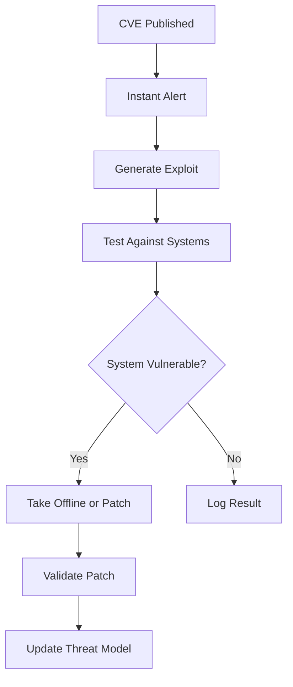
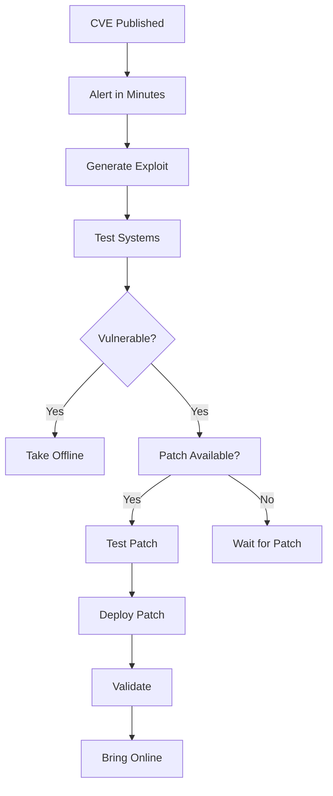
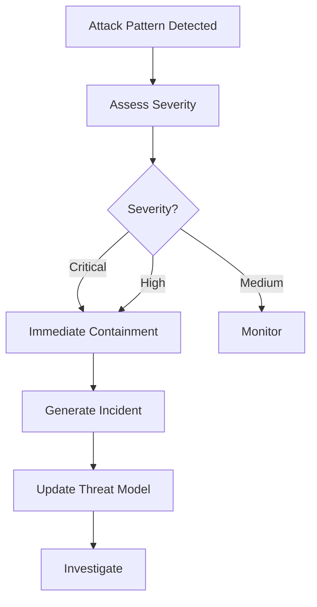

# Speed Automation: Defending Against AI-Accelerated Attacks

AI-accelerated attacks are 100x faster than human-driven attacks. AI can cut exfiltration time from roughly 2 days to 25 minutes, executing approximately 100 times faster than human attackers. This requires automated defense workflows that respond faster than human speed.

## Overview

Speed automation enables:

- **Instant Vulnerability Testing**: Test vulnerabilities within minutes of CVE publication
- **Automated Attack Response**: Automatically contain threats and generate incident reports
- **Patch Validation**: Instantly validate patches before deployment
- **Threat Model Updates**: Continuously update threat models based on new attacks

## The Speed Problem

### AI-Accelerated Attacks

According to threat intelligence research:

- **AI attacks are 100x faster**: 25 minutes vs 2 days for exfiltration
- **Physically impossible request rates**: Thousands of requests per second
- **Autonomous attack lifecycle**: Recon → Exploitation → Lateral Movement → Exfiltration
- **Multiple operations per second**: Unsustainable for human defense

### Vulnerability Cycle

The vulnerability cycle must be nearly instantaneous:

> "Things are either going to have to be taken offline or they're going to have to be fixed nearly instantaneously."

Traditional patch cycles (days or weeks) are no longer sufficient. Systems must either:
1. Be taken offline immediately when vulnerabilities are discovered
2. Be patched nearly instantaneously through automation

## Instant Vulnerability Testing

### Using `vulnerability_instant_test`

The `vulnerability_instant_test` tool enables instant vulnerability testing:

```typescript
// Instant CVE testing
{
  "cve": "CVE-2024-1234",
  "target": "production-systems",
  "instant_mode": true,
  "validate_patch": true
}
```

**Key Features:**

- **Real-Time CVE Monitoring**: Monitor CVE databases in real-time
- **Instant Exploit Generation**: Generate exploit attempts immediately
- **Automatic Testing**: Test against systems automatically
- **Patch Validation**: Validate patches instantly when available

**Workflow:**

1. **CVE Published**: Alert received within minutes
2. **Instant Alert**: System automatically notified
3. **Generate Exploit**: Exploit attempt generated immediately
4. **Test Systems**: Automatically test against target systems
5. **Validate Patch**: Test patch if available
6. **Update Threat Model**: Update threat model with new vulnerability

### Vulnerability Cycle Automation



## Automated Attack Response

### Using `attack_response_automated`

The `attack_response_automated` tool enables automated attack response:

```typescript
// Automated attack response
{
  "attack_pattern": "credential_theft",
  "severity": "high",
  "contain_threat": true,
  "generate_incident": true,
  "update_threat_model": true
}
```

**Key Features:**

- **Automatic Containment**: Isolate affected systems automatically
- **Incident Generation**: Generate incident reports automatically
- **Threat Model Updates**: Update threat models with new attack patterns
- **Response Time**: Respond faster than human speed

**Containment Actions:**

- Isolate affected systems
- Block malicious IPs/domains
- Disable compromised accounts
- Quarantine malicious files
- Stop suspicious processes

**Response Workflow:**

1. **Attack Detected**: Pattern detected automatically
2. **Automatic Containment**: Systems isolated immediately
3. **Incident Generation**: Incident report created automatically
4. **Threat Model Update**: Threat model updated with new pattern
5. **Investigation**: Security team investigates contained threat

## Speed Automation Workflows

### Workflow 1: Instant CVE Response



### Workflow 2: Automated Attack Response



## Configuration

Configure speed automation in your `openclaw.config.json`:

```json
{
  "security": {
    "speedAutomation": {
      "enabled": true,
      "vulnerabilityTesting": {
        "instantTest": true,
        "patchValidation": true
      },
      "attackResponse": {
        "automatedContainment": true,
        "incidentGeneration": true
      }
    }
  }
}
```

## Best Practices

1. **Automate Everything**: Automate as much of the response as possible
2. **Instant Testing**: Test vulnerabilities within minutes, not days
3. **Patch Validation**: Always validate patches before deployment
4. **Containment First**: Contain threats immediately, investigate later
5. **Continuous Updates**: Continuously update threat models based on new attacks
6. **Human Oversight**: Maintain human oversight for critical decisions

## Integration with Other Tools

Speed automation integrates with:

- **Threat Intelligence**: Use threat intelligence to prioritize vulnerabilities
- **Vulnerability Management**: Integrate with CVE databases and patch management
- **SIEM Systems**: Detect attack patterns in real-time
- **Incident Response**: Trigger incident response workflows automatically

## Related Documentation

- [Threat Hunting](/security/threat-hunting) - Proactive threat hunting
- [Security Automation](/security/automation) - Automated threat model extension
- [Defensive Security](/security/blue-team) - Blue team operations
