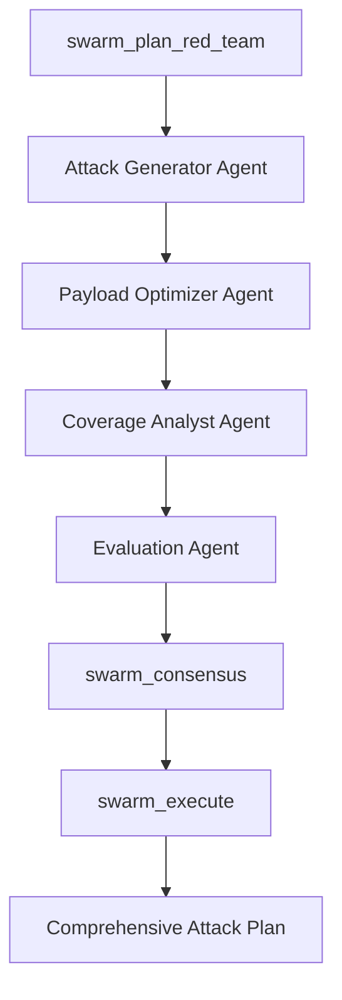
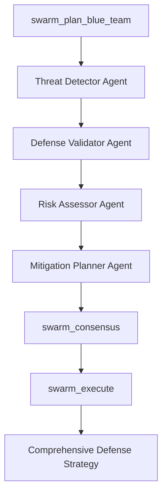
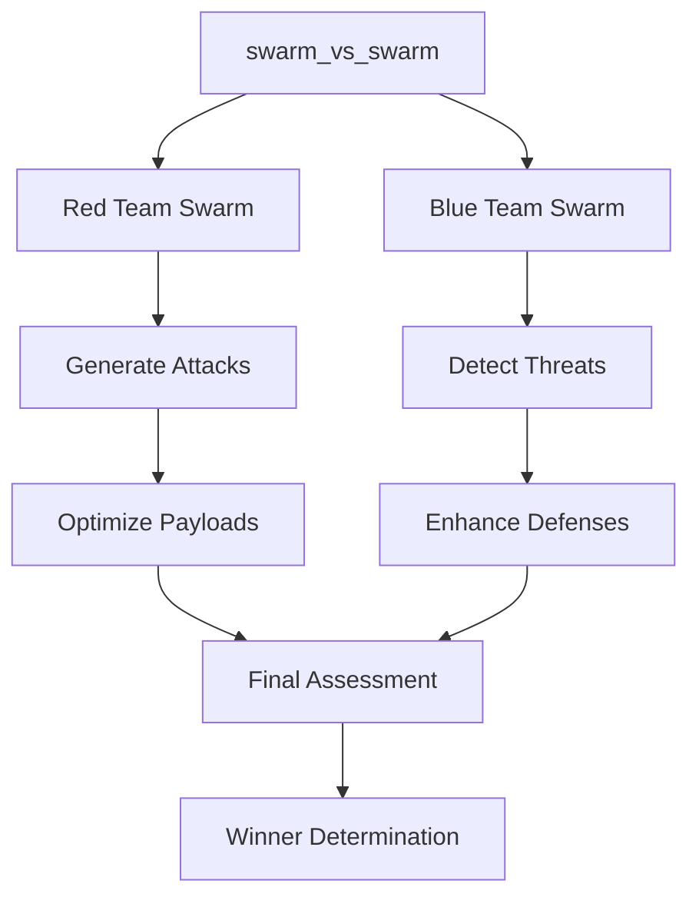

# Swarm Agent Planning: Red Team & Blue Team Collaboration

OpenClaw's swarm agent planning system enables coordinated multi-agent collaboration for both Red Team (ARR) and Blue Team (cognitive security) operations. Based on "society of minds" research and swarm intelligence principles, multiple specialized agents work together to solve complex security problems more effectively than single-agent approaches.

## Overview

Swarm agent planning implements a **"society of minds"** architecture where:

- Multiple specialized agents collaborate
- Each agent has distinct expertise and capabilities
- Agents discuss and refine solutions before presenting final answer
- Swarm intelligence emerges from agent collaboration
- Both Red Team and Blue Team can leverage swarm coordination

## Core Concept

**Single Agent**: "What attack/defense should I generate?"
**Swarm Agents**: "How can multiple specialized agents collaborate to generate better attacks/defenses?"

Swarm planning enables:

- **Red Team**: Coordinated multi-stage attacks, optimized payloads, comprehensive coverage
- **Blue Team**: Collaborative threat detection, multi-layer defense validation, comprehensive risk assessment

## Agent Specializations

### Red Team Agents

**Attack Generator Agent**

- Expertise: Generate attack candidates across all attack families
- Capabilities: Payload generation, attack family selection, delivery vector optimization
- Integration: Works with `arr_generate_attacks`

**Payload Optimizer Agent**

- Expertise: Mutate and optimize attack payloads for maximum effectiveness
- Capabilities: Mutation strategies, encoding transforms, stealth optimization
- Integration: Works with `arr_optimize_attack`

**Evaluation Agent**

- Expertise: Evaluate attacks against target systems and measure success
- Capabilities: Sandbox testing, failure predicate measurement, trace analysis
- Integration: Works with `arr_evaluate_attack`

**Coverage Analyst Agent**

- Expertise: Analyze attack coverage and identify gaps
- Capabilities: Technique coverage, surface coverage, gap identification
- Integration: Works with ARR coverage metrics

### Blue Team Agents

**Threat Detector Agent**

- Expertise: Detect cognitive threats and attack patterns
- Capabilities: Pattern detection, anomaly detection, risk scoring
- Integration: Works with `cognitive_threat_detect`

**Defense Validator Agent**

- Expertise: Validate defense mechanisms and guardrails
- Capabilities: Guardrail testing, architectural validation, policy checks
- Integration: Works with `decision_integrity_guard`, `llm_validate_guardrails`

**Risk Assessor Agent**

- Expertise: Assess risk levels and escalation potential
- Capabilities: Risk scoring, escalation analysis, impact assessment
- Integration: Works with `escalation_control`, `trust_trajectory_analyze`

**Mitigation Planner Agent**

- Expertise: Plan defensive mitigations and countermeasures
- Capabilities: Mitigation strategies, defense improvements, recovery planning
- Integration: Works with `graceful_degradation_mode`

## Tools

### `swarm_orchestrate`

Coordinate multiple specialized agents to collaborate on complex tasks.

**Parameters**:

- `swarm_type` (optional): One of `red_team`, `blue_team`, `both`
- `objective` (required): Task objective for swarm
- `agent_count` (optional): Number of agents (default: 4)
- `collaboration_mode` (optional): One of `sequential`, `parallel`, `consensus` (default: `consensus`)
- `output` (optional): Output file path

**Example**:

```json
{
  "swarm_type": "both",
  "objective": "Generate comprehensive attack plan and validate defenses",
  "agent_count": 8,
  "collaboration_mode": "consensus"
}
```

**Collaboration Modes**:

- **Sequential**: Agents work in order, each building on previous
- **Parallel**: Agents work simultaneously, results aggregated
- **Consensus**: Agents discuss and build consensus (recommended)

### `swarm_plan_red_team`

Coordinate Red Team agents to generate comprehensive attack plans.

**Parameters**:

- `target_system` (required): Target system identifier
- `attack_families` (optional): Array of attack families to cover
- `target_capability` (optional): Target capability (exfil, tool_misuse, etc.)
- `swarm_size` (optional): Number of agents (default: 4)
- `output` (optional): Output file path

**Collaboration Flow**:

1. Attack Generator Agent: Generate initial attack candidates
2. Payload Optimizer Agent: Optimize payloads for stealth
3. Coverage Analyst Agent: Analyze coverage gaps
4. Evaluation Agent: Evaluate attacks against target
5. All Agents: Collaborate to refine final attack plan

### `swarm_plan_blue_team`

Coordinate Blue Team agents to validate defenses and plan mitigations.

**Parameters**:

- `threat_scenario` (required): Threat scenario to defend against
- `defense_config` (optional): Defense configuration identifier
- `validation_depth` (optional): One of `basic`, `comprehensive`, `exhaustive`
- `swarm_size` (optional): Number of agents (default: 4)
- `output` (optional): Output file path

**Collaboration Flow**:

1. Threat Detector Agent: Analyze threat scenario
2. Defense Validator Agent: Validate defenses
3. Risk Assessor Agent: Assess risk levels
4. Mitigation Planner Agent: Plan mitigations
5. All Agents: Synthesize comprehensive defense strategy

### `swarm_consensus`

Build consensus from multiple agent opinions.

**Parameters**:

- `agent_opinions` (required): Array of agent opinions (objects with agent:opinion)
- `consensus_method` (optional): One of `majority`, `weighted`, `unanimous`
- `output` (optional): Output file path

**Consensus Methods**:

- **Majority**: Simple majority vote
- **Weighted**: Weight by agent expertise
- **Unanimous**: All agents must agree

### `swarm_execute`

Execute swarm plan with coordinated agent actions.

**Parameters**:

- `swarm_plan` (required): Swarm plan JSON
- `execution_mode` (optional): One of `simulated`, `sandboxed`, `live`
- `coordination_strategy` (optional): One of `centralized`, `decentralized`, `hybrid`
- `output` (optional): Output file path

**Execution Modes**:

- **Simulated**: Safe simulation without real actions
- **Sandboxed**: Isolated environment testing
- **Live**: Real execution (use with caution)

**Coordination Strategies**:

- **Centralized**: Single coordinator manages all agents
- **Decentralized**: Agents coordinate peer-to-peer
- **Hybrid**: Combination of centralized and decentralized

### `swarm_vs_swarm`

Simulate adversarial swarm battles between Red Team and Blue Team.

**Parameters**:

- `red_team_swarm` (optional): Red Team swarm configuration
- `blue_team_swarm` (optional): Blue Team swarm configuration
- `scenario` (required): Battle scenario description
- `duration` (optional): Simulation duration in seconds (default: 3600)
- `output` (optional): Output file path

**Battle Phases**:

1. Red Team: Generate coordinated attacks
2. Blue Team: Detect and respond
3. Red Team: Optimize undetected attacks
4. Blue Team: Enhance defenses
5. Final assessment: Compare success rates

### `swarm_collaborate`

Enable direct agent-to-agent collaboration on specific tasks.

**Parameters**:

- `agents` (required): Array of agent identifiers
- `task` (required): Task description
- `communication_protocol` (optional): One of `broadcast`, `hierarchical`, `peer_to_peer`
- `output` (optional): Output file path

**Communication Protocols**:

- **Broadcast**: All agents receive all messages
- **Hierarchical**: Messages flow through hierarchy
- **Peer-to-Peer**: Direct agent-to-agent communication

### `swarm_integrate_arr`

Integrate swarm planning with Adversary Recommender.

**Parameters**:

- `target_system` (required): Target system identifier
- `attack_families` (optional): Array of attack families
- `swarm_size` (optional): Number of agents (default: 4)
- `output` (optional): Output file path

**Workflow**:

1. Attack Generator → `arr_generate_attacks`
2. Payload Optimizer → `arr_optimize_attack`
3. Coverage Analyst → Coverage analysis
4. Evaluation Agent → `arr_evaluate_attack`
5. All Agents → `arr_rank_attacks`
6. Consensus → Final attack plan

### `swarm_integrate_cognitive`

Integrate swarm planning with cognitive security tools.

**Parameters**:

- `threat_scenario` (required): Threat scenario
- `validation_depth` (optional): Validation depth
- `swarm_size` (optional): Number of agents (default: 4)
- `output` (optional): Output file path

**Workflow**:

1. Threat Detector → `cognitive_threat_detect`
2. Defense Validator → `decision_integrity_guard`, `llm_validate_guardrails`
3. Risk Assessor → `escalation_control`, `trust_trajectory_analyze`
4. Mitigation Planner → `graceful_degradation_mode`
5. Consensus → Defense strategy

## Configuration

Configure swarm agents in `~/.openclaw/openclaw.json`:

```json
{
  "security": {
    "swarmAgents": {
      "enabled": true,
      "workspace": "~/.openclaw/security/swarm/",
      "redTeamSwarm": {
        "enabled": true,
        "defaultSwarmSize": 4,
        "agents": [
          "attack_generator",
          "payload_optimizer",
          "evaluation_agent",
          "coverage_analyst"
        ]
      },
      "blueTeamSwarm": {
        "enabled": true,
        "defaultSwarmSize": 4,
        "agents": [
          "threat_detector",
          "defense_validator",
          "risk_assessor",
          "mitigation_planner"
        ]
      },
      "collaboration": {
        "enabled": true,
        "defaultMode": "consensus",
        "communicationProtocol": "peer_to_peer"
      },
      "swarmVsSwarm": {
        "enabled": true,
        "schedule": "0 3 * * *",
        "duration": 3600
      },
      "integration": {
        "arrIntegration": true,
        "cognitiveIntegration": true,
        "heartbeatIntegration": true
      }
    }
  }
}
```

## Workflows

### Red Team Swarm Attack Generation



### Blue Team Swarm Defense Validation



### Swarm vs Swarm Battle



## Integration Examples

### Swarm-Enhanced ARR Workflow

```json
{
  "tool": "swarm_integrate_arr",
  "target_system": "production",
  "attack_families": ["boundary_confusion", "rag_poisoning"],
  "swarm_size": 4
}
```

This triggers:

1. Attack Generator Agent uses `arr_generate_attacks`
2. Payload Optimizer Agent uses `arr_optimize_attack`
3. Evaluation Agent uses `arr_evaluate_attack`
4. Coverage Analyst analyzes gaps
5. All agents collaborate via `swarm_consensus`
6. Final plan executed via `swarm_execute`

### Swarm-Enhanced Cognitive Security

```json
{
  "tool": "swarm_integrate_cognitive",
  "threat_scenario": "Multi-stage prompt injection attack",
  "validation_depth": "comprehensive",
  "swarm_size": 4
}
```

This triggers:

1. Threat Detector Agent uses `cognitive_threat_detect`
2. Defense Validator Agent uses `decision_integrity_guard`
3. Risk Assessor Agent uses `escalation_control`
4. Mitigation Planner Agent uses `graceful_degradation_mode`
5. All agents collaborate via `swarm_consensus`
6. Defense strategy executed via `swarm_execute`

## Advantages of Swarm Planning

### Red Team Advantages

1. **Coordinated Attacks**: Multiple agents create multi-stage attacks
2. **Optimization**: Specialized agents optimize different aspects
3. **Coverage**: Coverage analyst ensures comprehensive testing
4. **Consensus**: Prevents single-agent blind spots

### Blue Team Advantages

1. **Multi-Layer Validation**: Different agents validate different defense layers
2. **Risk Assessment**: Multiple perspectives improve risk analysis
3. **Comprehensive Mitigation**: Collaborative planning ensures thorough coverage
4. **Consensus Building**: Reduces false positives/negatives

### General Advantages

1. **Better Solutions**: Swarm intelligence emerges from collaboration
2. **Specialization**: Each agent focuses on their expertise
3. **Error Reduction**: Consensus catches individual agent mistakes
4. **Coverage**: Multiple agents ensure comprehensive analysis

## Real-World Example: Swarm vs Swarm

```json
{
  "tool": "swarm_vs_swarm",
  "scenario": "Production system defense validation",
  "duration": 3600
}
```

**Battle Flow**:

1. **Red Team Swarm** (4 agents):
   - Attack Generator creates 25 attack candidates
   - Payload Optimizer optimizes for stealth
   - Coverage Analyst identifies gaps
   - Evaluation Agent tests effectiveness

2. **Blue Team Swarm** (4 agents):
   - Threat Detector identifies 18 attacks
   - Defense Validator tests guardrails
   - Risk Assessor evaluates escalation
   - Mitigation Planner updates defenses

3. **Outcome**:
   - Red Team success: 45%
   - Blue Team detection: 55%
   - Both sides improve through adversarial interaction

## Best Practices

1. **Use Consensus Mode**: Default to consensus for best results
2. **Appropriate Swarm Size**: 4 agents optimal for most tasks
3. **Specialized Agents**: Assign agents based on expertise
4. **Regular Swarm Battles**: Run swarm vs swarm regularly
5. **Integration**: Leverage swarm with ARR and cognitive security
6. **Monitor Collaboration**: Review agent discussions
7. **Iterate**: Use swarm results to improve individual agents

## Heartbeat Integration

Add swarm operations to `HEARTBEAT.md`:

```markdown
# Heartbeat checklist

- Quick scan: anything urgent in inboxes?
- Run lightweight swarm validation:
  - Blue Team swarm: Quick threat detection
  - If threats detected, trigger full swarm defense planning
- If it's daytime, do a lightweight check-in if nothing else is pending.
```

## Cron Integration

Schedule regular swarm vs swarm battles:

```bash
openclaw cron add \
  --name "Daily Swarm Battle" \
  --cron "0 3 * * *" \
  --session isolated \
  --message "Run swarm_vs_swarm: Red Team vs Blue Team battle for continuous improvement" \
  --announce
```

## Security Considerations

- **Isolation**: Swarm operations run in sandboxed environments
- **Authorization**: Only authorized systems can be targeted
- **Rate Limiting**: Respect rate limits on API calls
- **Logging**: All swarm activities are logged
- **Ethical Use**: Use responsibly and ethically
- **Live Mode Caution**: Use live execution mode with extreme caution

## Related Documentation

- [Adversary Recommender](./adversary-recommender.md)
- [Cognitive Security](./cognitive-security.md)
- [LLM Security](./llm-security.md)
- [Red Team Operations](./red-team.md)
- [Blue Team Operations](./blue-team.md)

## Conclusion

Swarm agent planning transforms OpenClaw into a **collaborative multi-agent security platform** where specialized agents work together to solve complex problems. By enabling both Red Team and Blue Team swarms, OpenClaw provides:

- **Better Attack Generation**: Coordinated multi-stage attacks
- **Comprehensive Defense**: Multi-layer validation and mitigation
- **Continuous Improvement**: Swarm vs swarm adversarial testing
- **Swarm Intelligence**: Emergent solutions from agent collaboration

The "society of minds" approach ensures that security operations benefit from multiple perspectives, specialized expertise, and collaborative problem-solving, resulting in more effective attacks and defenses than single-agent approaches.
