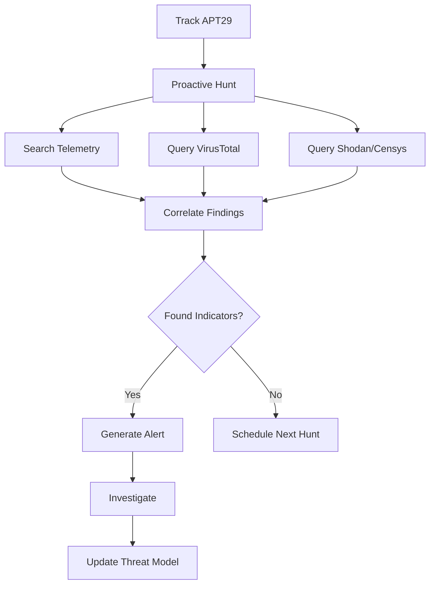
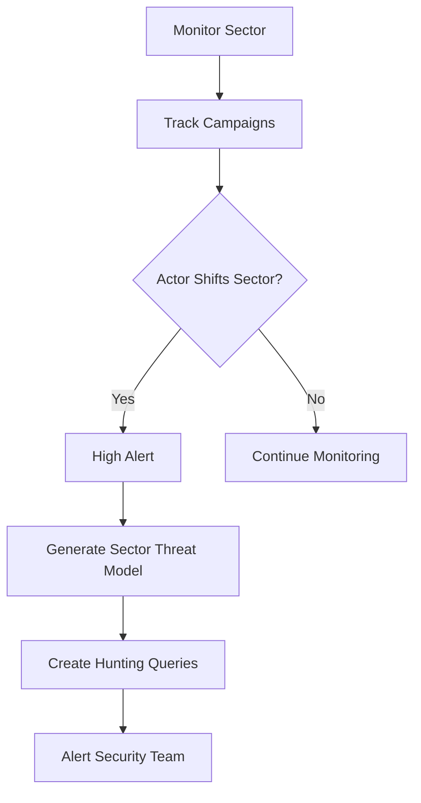
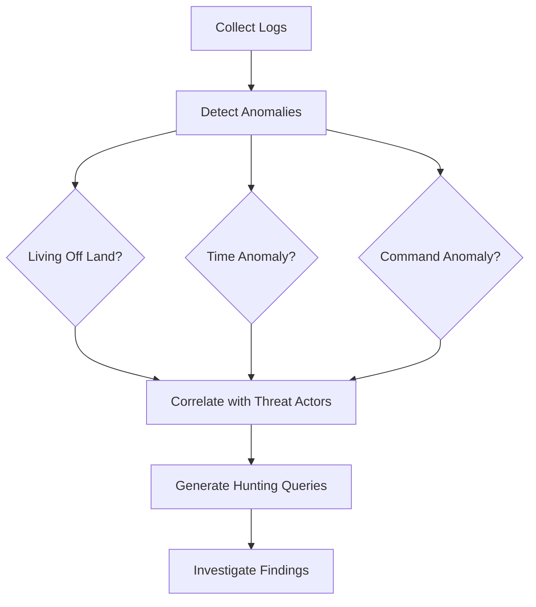

# Threat Hunting: Proactive Security Operations

Proactive threat hunting is essential for staying ahead of adversaries. Instead of passively waiting for alerts, threat hunters actively search for known threat actors, track sector-specific attack patterns, and detect anomalies that indicate malicious activity.

## Overview

OpenClaw provides comprehensive threat hunting capabilities:

- **Proactive Actor Hunting**: Actively hunt for specific threat actors (APT29, Volt Typhoon, Scattered Spider) across telemetry, VirusTotal, Shodan, and Censys
- **Sector Intelligence**: Track sector-specific attack patterns and alert when actors shift sectors
- **Anomaly Detection**: AI-powered detection of living-off-the-land techniques, time-based anomalies, and suspicious patterns

## Proactive Threat Actor Hunting

### Why Proactive Hunting?

As noted in threat intelligence discussions, we need to "go out and hunt for them" - not just passively wait. High-priority threat actors like APT29 (associated with SolarWinds) are "apex predators" that require active hunting across telemetry, VirusTotal, and incident data.

### Using `threat_hunt_proactive`

The `threat_hunt_proactive` tool enables proactive hunting for specific threat actors:

```typescript
// Hunt for APT29 across multiple sources
{
  "actor_id": "apt29",
  "sources": ["telemetry", "virustotal", "shodan", "censys"],
  "time_range": "last_30_days",
  "iocs": ["1.2.3.4", "malicious-domain.com"],
  "ttps": ["T1078", "T1566"]
}
```

**Key Features:**

- **Multi-Source Search**: Query telemetry, VirusTotal, Shodan, and Censys simultaneously
- **IOC Correlation**: Search for known IOCs associated with the threat actor
- **TTP Matching**: Search for MITRE ATT&CK techniques used by the actor
- **Hunting Query Generation**: Automatically generate SIEM/log queries for hunting

**Example Workflow:**

1. **Identify Threat Actor**: Track APT29 using `threat_track_actor`
2. **Proactive Hunt**: Use `threat_hunt_proactive` to search across all sources
3. **Correlate Findings**: Review IOCs and TTPs found across sources
4. **Generate Hunting Queries**: Execute queries in your SIEM/logging system
5. **Investigate Findings**: Follow up on any indicators found

## Sector-Specific Threat Hunting

### Tracking Sector Shifts

Threat actors often shift between sectors. For example, Scattered Spider has targeted:
- UK retail (April)
- US retail (May)
- Insurance (June)
- Aviation sector (recently)

### Using `threat_hunt_sector`

The `threat_hunt_sector` tool tracks sector-specific attack patterns:

```typescript
// Track retail sector threats
{
  "sector": "retail",
  "actor_id": "scattered-spider",
  "time_range": "last_90_days",
  "alert_on_shift": true
}
```

**Key Features:**

- **Sector Campaign Tracking**: Monitor active campaigns targeting specific sectors
- **Sector Shift Detection**: Alert when actors shift to new sectors
- **Sector-Specific Queries**: Generate sector-specific hunting queries
- **Early Warning**: Get alerts before actors fully shift to your sector

**Supported Sectors:**

- Retail
- Insurance
- Aviation
- Healthcare
- Financial
- Critical Infrastructure

## Anomaly Detection

### Living Off The Land

Many advanced threat actors use "living off the land" techniques - using legitimate system tools maliciously. Volt Typhoon is particularly known for this approach.

### Using `threat_hunt_anomaly`

The `threat_hunt_anomaly` tool detects various anomaly types:

```typescript
// Detect living-off-the-land techniques
{
  "data_source": "endpoint_logs",
  "anomaly_type": "living_off_the_land",
  "time_range": "last_7_days"
}
```

**Anomaly Types:**

1. **Living Off The Land**: Detect legitimate tools used maliciously
   - PowerShell with encoded commands
   - Certutil for file operations
   - Bitsadmin for downloads
   - Regsvr32 for script execution
   - WMI for lateral movement

2. **Time-Based Anomalies**: Detect activity outside normal hours
   - Operating outside business hours
   - Weekend/holiday activity
   - Activity in unusual timezones (e.g., Beijing hours for Volt Typhoon)

3. **Command Sequence Anomalies**: Detect unusual command patterns
   - Unusual command sequences
   - Rapid command execution
   - Commands not typically used together

4. **Process Injection**: Detect process injection techniques
   - Process hollowing
   - DLL injection
   - Thread hijacking

5. **Credential Access**: Detect credential dumping
   - LSASS process access
   - Registry credential access
   - Credential dumping tools

## Threat Hunting Workflows

### Workflow 1: Proactive APT29 Hunt



### Workflow 2: Sector Shift Detection



### Workflow 3: Anomaly Detection



## Configuration

Configure threat hunting in your `openclaw.config.json`:

```json
{
  "security": {
    "threatHunting": {
      "enabled": true,
      "proactiveHunting": {
        "enabled": true,
        "actors": ["apt29", "volt-typhoon", "scattered-spider"],
        "schedule": "0 2 * * *",
        "sources": ["telemetry", "virustotal", "shodan", "censys"]
      },
      "anomalyDetection": {
        "enabled": true,
        "livingOffTheLand": true,
        "timeBasedAnomalies": true
      },
      "sectorTracking": {
        "enabled": true,
        "sectors": ["retail", "insurance", "aviation", "healthcare"]
      }
    }
  }
}
```

## Best Practices

1. **Prioritize High-Value Targets**: Focus on "apex predators" like APT29 first
2. **Resource Allocation**: Use threat intelligence to allocate limited resources efficiently
3. **Multi-Source Correlation**: Always correlate findings across multiple sources
4. **Continuous Monitoring**: Set up scheduled hunts for critical threat actors
5. **Sector Awareness**: Monitor sector shifts for early warning
6. **Anomaly Baselines**: Establish baselines for normal behavior to detect anomalies

## Integration with Other Tools

Threat hunting integrates with:

- **Threat Intelligence**: Use tracked actors and IOCs for hunting
- **SIEM Systems**: Execute hunting queries in Splunk, Elastic, Sentinel
- **Red Team Exercises**: Validate detection capabilities through red team exercises
- **Incident Response**: Use hunting findings to trigger incident response

## Related Documentation

- [Security Automation](/security/automation) - Automated threat model extension
- [Red Team Operations](/security/red-team) - Red team pen testing workflows
- [Threat Intelligence](/cybersecurity/threat-intelligence) - Threat intelligence tracking
